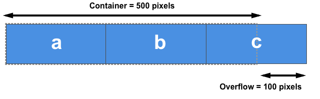

我们将探索应用于弹性（flex）元素的三个属性，它们能使我们在主轴方向上控制弹性元素的尺寸和伸缩性——flex-grow、flex-shrink 和 flex-basis。

这三个属性控制弹性元素的以下几个方面的灵活性：

+ flex-grow：该元素(拉伸)获得多少正可用空间
+ flex-shrink：该元素(收缩)要消除多少负可用空间
+ flex-basis：在该元素未拉伸和收缩之前，它所占空间

在考虑 flex 属性如何在主轴方向上控制比率之前，有一些概念值得我们去深究。这涉及到弹性元素在任何伸缩之前的自然尺寸，以及可用空间（free space）的概念。

# 弹性元素的尺寸

在 CSS 中还有 min-content 和 max-content 这两个概念；这两个关键字可以用来代替长度单位。

+ min-content：本质上讲，就是字符串中最长的单词长度决定的大小。
+ max-content：代表了内容的最大宽度或最大高度。对于文本内容而言，这意味着内容即便溢出也不会被换行。

# 正负可用空间

当一个弹性容器有正可用空间时，它就有更多的空间用于在容器内显示弹性元素。比如说，如果我们有 500px 宽的容器，flex-direction 属性值为 row，三个 100px 宽的弹性元素，那么我们还有 200px 的正可用空间，如果我们想要填充整个容器，则可将其分配到元素中。

  

当弹性元素的自然尺寸加起来比弹性容器内的可用空间大时，我们产生了负可用空间。比如我们有一个像上面那样的 500px 宽的容器，但是三个弹性元素每个都为 200px 宽，那我们就一共需要 600px 宽，因此就有了 100px 的负可用空间。这可以从弹性元素中删除以使其能适应容器。

  

# flex-basis 属性
flex-basis 属性在任何空间分配发生之前初始化弹性元素的尺寸。此属性的初始值为 auto。如果 flex-basis 设置为 auto，浏览器会先检查元素的主尺寸是否设置了绝对值再计算出它们的初始值。比如说你已经给你的元素设置了 200px 的宽，则 200px 就是这个元素的 flex-basis。

如果你的元素为自动调整大小，则 auto 会解析为其内容的大小。此时你所熟知的 min-content 和 max-content 大小会变得有用，弹性盒子会将元素的 max-content 大小作为 flex-basis。

空间分配时，如果你想要弹性盒子完全忽略元素的尺寸就需要设置 flex-basis 为 0。这显式地说明弹性盒子可用抢占所有空间，并按比例进行分配。

flex-basis属性会覆盖项目的width属性（当主轴方向水平时）或height属性（当主轴方向垂直时），然而，flex-basis属性仍然受max-width/max-height和min-width/min-height属性的约束。

# flex-grow 属性
flex-grow 属性指定了弹性增长因子（flex grow factor），这决定了在分配正可用空间时，弹性元素相对于弹性容器中的其余弹性元素的增长程度。

如果 flex-grow 的值全部相同，并且在弹性容器中还有正可用空间，那么它就会被平均地分配给所有元素。

# flex-shrink 属性
flex-shrink 属性指定了弹性收缩因子（flex shrink factor），它确定在分配负可用空间时，弹性元素相对于弹性容器中其余弹性元素收缩的程度。

# 掌握弹性元素的大小

## 什么设置了元素的基本大小？
1. flex-basis 设置为 auto，且元素设置了宽度，元素的大小将会基于设置的宽度。
2. flex-basis 设置为 auto 或 content（在支持的浏览器中），元素的大小为原始大小。
3. flex-basis 设置为 非0的长度，那这就是元素的大小。
4. flex-basis 设为了 0，则元素的大小不在空间分配计算的考虑之内。

## 我们有可用空间吗？
1. 元素没有正可用空间就不会增长，没有负可用空间就不会缩小。
2. 如果我们把所有元素的宽度相加（如果在列方向工作则为高度），总和小于容器的总宽度（或高度），那么你有正可用空间，并且 flex-grow 会发挥作用。
3. 如果我们把所有的元素的宽度相加（如果在列方向工作则为高度），总和大于容器的总宽度（或高度），那么你有负可用空间，并且 flex-shrink 会发挥作用。

## 关于flex-grow属性的计算过程为
1. flex-grow属性小于等于0的项目不受影响，不会伸长。
2. 对剩余项目的flex-grow属性进行求和，将结果记为sum。
3. 分以下情况进行讨论。
**sum ≥ 1 时 计算过程：**
```css

.container {
  display: flex;
  width: 800px;
  .item1 {
    flex-basis: 50px;
  }
  .item2 {
    flex-basis: 100px;
    flex-grow: 1;
  }
  .item3 {
    flex-basis: 150px;
    flex-grow: 3;
  }
  .item4 {
    flex-basis: 200px;
    flex-grow: 6;
  }
}
```
   1. 计算剩余宽度：剩余宽度 = 容器宽度 - 项目总宽度，所以：剩余宽度 = 800px - 500px = 300px。
   2. 计算各项目权重占比：权重 = <flex-grow>，所以：
      1. 总权重 = sum = 1 + 3 + 6 = 10。
      2. 项目2权重 = 1，项目2权重占比 = 1 / 10 = 0.1。
      3. 项目3权重 = 3，项目3权重占比 = 3 / 10 = 0.3。
      4. 项目4权重 = 6，项目4权重占比 = 6 / 10 = 0.6。
   3. 计算各项目伸长宽度：伸长宽度 = 权重占比 * 剩余宽度，所以：
      1. 项目2伸长宽度 = 0.1 * 300px = 30px。
      2. 项目3伸长宽度 = 0.3 * 300px = 90px。
      3. 项目4伸长宽度 = 0.6 * 300px = 180px。
   4. 计算各项目伸长后宽度：伸长后宽度 = <flex-basis> + 伸长宽度，所以：
      1. 项目2伸长后宽度 = 100px + 30px = 130px。
      2. 项目3伸长后宽度 = 150px + 90px = 240px。
      3. 项目4伸长后宽度 = 200px + 180px = 380px。

**sum < 1 时**

> 计算过程基本与sum > 1时的情况相同，但在第 3 步中，各项目的伸长宽度为sum * 权重占比 * 剩余宽度。

## 关于flex-shrink属性的计算过程为

1. flex-shrink属性小于等于0的项目不受影响，不会缩短。
2. 对剩余项目的flex-shrink属性进行求和，将结果记为sum。
3. 分以下情况进行讨论。
**sum ≥ 1 时**
```css
.container {
  display: flex;
  width: 800px;
  .item1 {
    flex-basis: 100px;
  }
  .item2 {
    flex-basis: 200px;
    flex-shrink: 6;
  }
  .item3 {
    flex-basis: 300px;
    flex-shrink: 3;
  }
  .item4 {
    flex-basis: 400px;
    flex-shrink: 1;
  }
}
```

1. 计算溢出宽度：溢出宽度 = 项目总宽度 - 容器宽度，所以：溢出宽度 = 800px - 1000px = 200px。
2. 计算各项目权重占比：权重 = <flex-shrink> * <flex-basis>，所以：
   1. 总权重 = 1200 + 900 + 400 = 2500。
   2. 项目2权重 = 1200，项目2权重占比 = 1200 / 2500 = 0.48。
   3. 项目3权重 = 900，项目3权重占比 = 900 / 2500 = 0.36。
   4. 项目4权重 = 400，项目4权重占比 = 400 / 2500 = 0.16。
3. 计算各项目缩短宽度：缩短宽度 = 权重占比 * 溢出宽度，所以：
   1. 项目2伸长宽度 = 0.48 * 200px = 96px。
   2. 项目3伸长宽度 = 0.36 * 200px = 72px。
   3. 项目4伸长宽度 = 0.16 * 200px = 32px。
4. 计算各项目缩短后宽度：缩短后宽度 = 原始宽度 - 缩短宽度，所以：
   1. 项目2缩短后宽度 = 200px - 96px = 104px。
   2. 项目3缩短后宽度 = 300px - 72px = 228px。
   3. 项目4缩短后宽度 = 400px - 32px = 368px。

**sum < 1 时**
> 计算过程基本与sum > 1时的情况相同，但在第 3 步中，各项目的缩短宽度为sum * 权重占比 * 溢出宽度。


