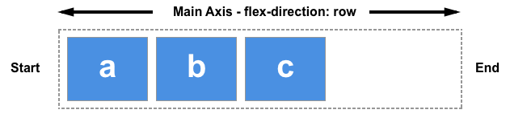

我们说 flexbox 是一种一维的布局，是因为一个 flexbox 一次只能处理一个维度上的元素布局，一行或者一列。作为对比的是另外一个二维布局 CSS Grid Layout，可以同时处理行和列上的布局。

# flexbox 的两根轴线
当使用 flex 布局时，首先想到的是两根轴线 — 主轴和交叉轴。**主轴由 flex-direction 定义**，另一根轴垂直于它。我们使用 flexbox 的所有属性都跟这两根轴线有关，所以有必要在一开始首先理解它。

## 主轴

主轴由 flex-direction 定义，可以取 4 个值：
+ row
+ row-reverse
+ column
+ column-reverse
  
如果你选择了 row 或者 row-reverse，你的主轴将沿着 inline 方向延伸。
  

选择 column 或者 column-reverse 时，你的主轴会沿着上下方向延伸 — 也就是 block 排列的方向。

  

## 交叉轴
交叉轴垂直于主轴，所以如果你的flex-direction (主轴) 设成了 row 或者 row-reverse 的话，交叉轴的方向就是沿着列向下的。

  

如果主轴方向设成了 column 或者 column-reverse，交叉轴就是水平方向。
  

理解主轴和交叉轴的概念对于对齐 flexbox 里面的元素是很重要的；flexbox 的特性是沿着主轴或者交叉轴对齐之中的元素。

# 起始线和终止线

过去，CSS 的书写模式主要被认为是水平的，从左到右的。现代的布局方式涵盖了书写模式的范围，所以我们不再假设一行文字是从文档的左上角开始向右书写，新的行也不是必须出现在另一行的下面。

如果 flex-direction 是 row ，并且我是在书写英文，那么主轴的起始线是左边，终止线是右边。
  
如果我在书写阿拉伯文，那么主轴的起始线是右边，终止线是左边。

在这两种情况下，交叉轴的起始线是 flex 容器的顶部，终止线是底部，因为两种语言都是水平书写模式。

# Flex 容器

文档中采用了`flexbox`的区域就叫做`flex`容器。为了创建 `flex`容器，我们把一个容器的`display`属性值改为`flex` 或者`inline-flex`。完成这一步之后，容器中的直系子元素就会变为`flex`元素。所有 CSS 属性都会有一个初始值，所以 flex 容器中的所有 flex 元素都会有下列行为：

+ 元素排列为一行 (flex-direction 属性的初始值是 row)。
+ 元素从主轴的起始线开始。
+ 元素不会在主维度方向拉伸，但是可以缩小。
+ 元素被拉伸来填充交叉轴大小。
+ flex-basis 属性为 auto。
+ flex-wrap 属性为 nowrap。
  
这会让你的元素呈线形排列，并且把自己的大小作为主轴上的大小。如果有太多元素超出容器，它们会溢出而不会换行。如果一些元素比其他元素高，那么元素会沿交叉轴被拉伸来填满它的大小。

